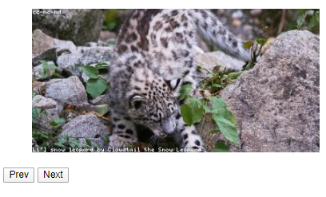
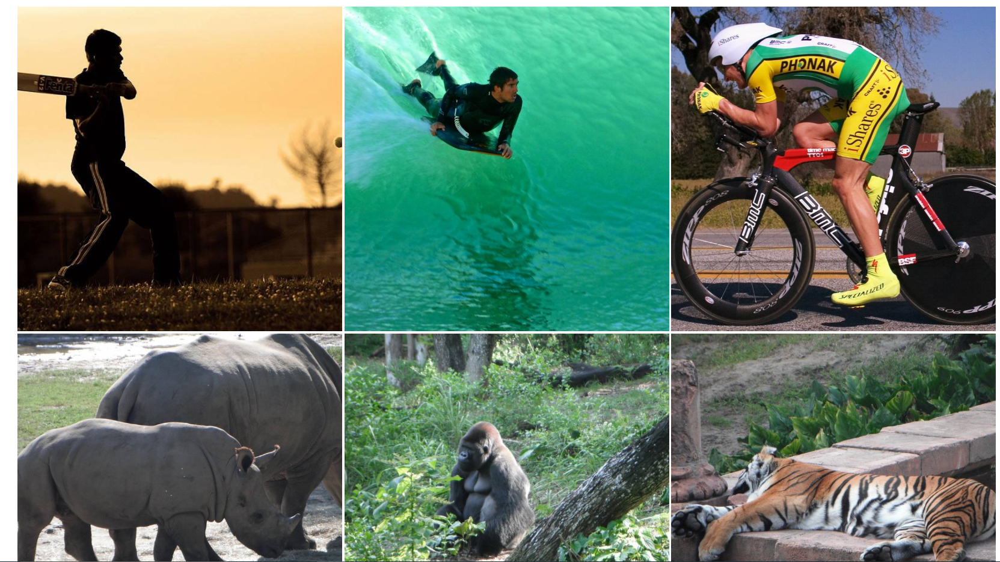
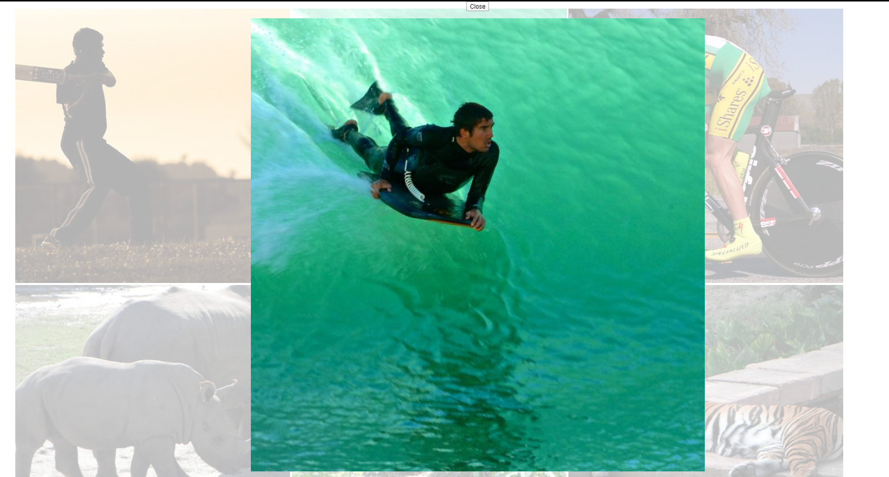
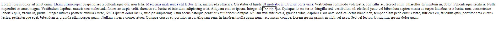
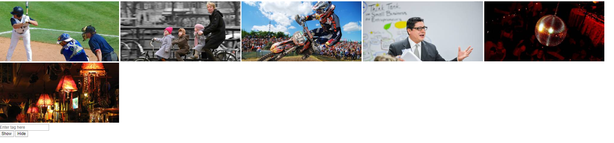
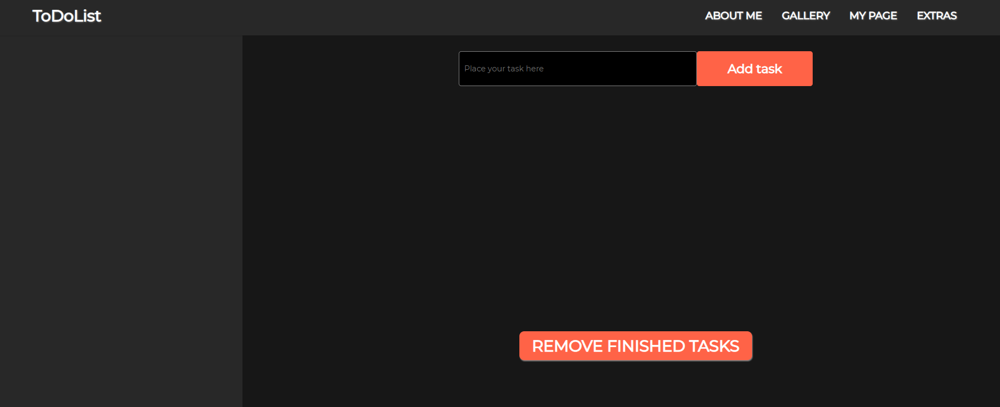

# Website Components

## Table of contents
* [General info](#general-info)
* [Screenshots](#screenshots)
* [Technologies](#technologies)
* [Setup](#setup)
* [Features](#features)
* [Status](#status)
* [Inspiration](#inspiration)
* [Contact](#contact)

## General info
Here you can see basic components written in Vanilla HTML 5, CSS4 andJavaScript. 

## Screenshots
###Slider

###Gallery

### Gallery Photo View

###Tooltips

### Gallery with Filter

###To Do List

## Technologies
* HTML - version 5.0
* CSS - version 4.0
* Vanilla JavaScript ECMAScript 5

## Setup
You have to clone repository and open HTML with selected component

## Features
List of features 
* Typical slider
* Gallery
* Tooltips
* Gallery with Filter
* To Do List

## Status
Project is: _done_, 

## Inspiration
Project inspired based on CodersLab guidelines. 

## Contact
Created by Mateusz Kusmierczyk. Feel free to contact me!

